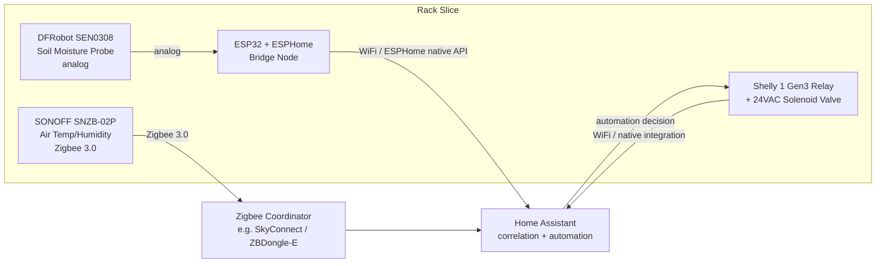

# Integration & Control Design

## 1. Block diagram



Everything reports into HA as first-class entities; HA owns all decision logic. No device talks directly to another device.

## 2. How each device joins HA and what entities it exposes

| Device | Join method | Entities exposed |
|---|---|---|
| ESP32 bridge (moisture) | ESPHome native API, auto-discovered by HA's ESPHome integration once flashed | `sensor.rack1_substrate_moisture` (%, calibrated), `sensor.rack1_substrate_moisture_raw` (ADC counts), `binary_sensor.rack1_moisture_sensor_fault` |
| SNZB-02P (temperature) | Paired to the Zigbee coordinator, discovered via ZHA or Zigbee2MQTT | `sensor.rack1_air_temperature`, `sensor.rack1_air_humidity`, `sensor.rack1_temp_sensor_battery` |
| Shelly 1 Gen3 (valve relay) | Native Shelly HA integration (local, no cloud) over WiFi | `switch.rack1_irrigation_valve`, `sensor.rack1_valve_relay_uptime` |

All three show up as ordinary HA entities — nothing about the bridge is visible to the automations layer; a native Matter valve could swap in later without touching the automation YAML.

## 3. Bridging design — the non-native moisture sensor

**Hardware:** DFRobot SEN0308 analog output → ESP32 GPIO34 (ADC1, avoids WiFi-radio ADC2 conflicts). Powered from the ESP32's 3.3V rail. A 100nF cap across signal/GND smooths analog noise.

**Firmware — ESPHome YAML:**

```yaml
esphome:
  name: rack1-moisture-bridge
  friendly_name: "Rack 1 Moisture Bridge"

esp32:
  board: esp32dev
  framework:
    type: arduino

wifi:
  ssid: !secret wifi_ssid
  password: !secret wifi_password
  fast_connect: true

api:
  encryption:
    key: !secret api_key

ota:
  password: !secret ota_password

logger:

sensor:
  - platform: adc
    pin: GPIO34
    id: moisture_raw
    name: "Rack 1 Substrate Moisture Raw"
    attenuation: 12db
    update_interval: 60s
    filters:
      - median:
          window_size: 5
          send_every: 5
          send_first_at: 1

  - platform: template
    name: "Rack 1 Substrate Moisture"
    id: moisture_calibrated
    unit_of_measurement: "%"
    accuracy_decimals: 1
    lambda: |-
      // calibration points, bench-measured: dry ~ 2.8V, wet ~ 1.2V
      float dry_v = 2.80;
      float wet_v = 1.20;
      float v = id(moisture_raw).state;
      float pct = (dry_v - v) / (dry_v - wet_v) * 100.0;
      if (pct < 0) pct = 0;
      if (pct > 100) pct = 100;
      return pct;
    update_interval: 60s

binary_sensor:
  - platform: template
    name: "Rack 1 Moisture Sensor Fault"
    lambda: |-
      // flags implausible readings: sensor open-circuit or shorted
      float v = id(moisture_raw).state;
      return (v < 0.2 || v > 3.2);
```

**Why this path over the alternatives:** an MQTT-discovery bridge would work too, but ESPHome's native API gives auto-discovery, encrypted transport, and OTA updates out of the box with far less boilerplate than hand-rolling MQTT discovery payloads. A Matter bridge device was ruled out — Matter has no analog-sensor bridging class today, so it would need a custom Matter accessory implementation, which is strictly more custom glue than ESPHome for the same 6–8 hour budget. The result: the moisture sensor shows up in HA exactly like a native Matter device — same entity model, same automation surface, fully swappable later.

## 4. Correlation logic

**Goal:** irrigate only when the substrate is dry *and* conditions won't cause harm (e.g., don't irrigate into a cold snap where wet+cold substrate risks root rot).

- **Thresholds:** irrigate if `moisture < 30%` AND `air_temperature > 15°C` (59°F)
- **Hysteresis:** stop irrigating once `moisture >= 45%` (15-point gap prevents chattering right at the 30% line)
- **Anti-short-cycling:** minimum 30-minute cooldown between valve activations regardless of readings; max single-run duration capped at 3 minutes (fail-safe against a stuck-open condition)
- **Temperature veto persists independently:** even if moisture drops below 30%, irrigation is skipped (and logged) if temperature is below 15°C — this is the genuinely joint decision, not two independent loops

## 5. Failure modes and safe states

| Failure | Detection | Safe state |
|---|---|---|
| Moisture sensor offline | ESPHome node unavailable > 10 min | Freeze last-known valve state; block new irrigation cycles; alert |
| Moisture reading implausible | `binary_sensor.rack1_moisture_sensor_fault` true (voltage out of physical range) | Block irrigation decisions using moisture; alert |
| Temp sensor offline | Zigbee entity unavailable > 15 min (battery device, longer grace period) | Block irrigation decisions using temperature; alert |
| Valve relay stuck open | Valve `on` for longer than max-run cap (3 min) with no HA-issued `off` acknowledged | Force relay off via direct Shelly local API call bypassing HA if unreachable; alert |
| HA restart | Automation reload | Valve defaults to `off` on ESPHome/Shelly boot (both configured with restore_mode: ALWAYS_OFF) |
| Network/WiFi loss | Shelly loses HA connectivity | Shelly's own local schedule (configured as a conservative backup, e.g. max 2 min/day) takes over until HA reconnects |

## 6. Bench-test order

1. Power and flash the ESP32 bridge standalone; verify raw ADC readings in dry air and in a glass of water (sanity-check calibration constants)
2. Pair the SNZB-02P to the Zigbee coordinator; confirm entity appears in HA with plausible readings
3. Wire the Shelly relay to a bench LED (not the real valve yet); verify HA can toggle it and that `restore_mode: ALWAYS_OFF` holds after a power cycle
4. Load the correlation automation with HA input_number helpers simulating sensor values; step through the threshold/hysteresis boundaries manually
5. Only then connect the real solenoid valve; run one supervised irrigation cycle end-to-end
6. Pull power to the ESP32 mid-cycle to confirm the "sensor offline" safe state actually halts irrigation
7. Leave running unattended for 24 hours before trusting the 21-day window

## Time accounting (target: 6-8 hours)

- Component research and matrix: ~2 hrs
- ESPHome bridge design and YAML: ~1.5 hrs
- Correlation logic and failure-mode table: ~1.5 hrs
- HA automation YAML and dashboard: ~1.5 hrs
- AI-usage appendix and writeup polish: ~1 hr
